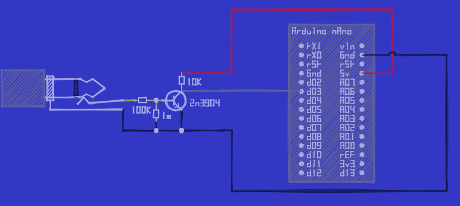
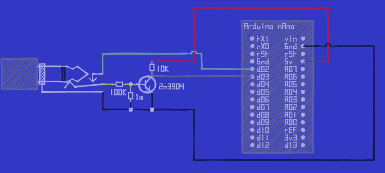
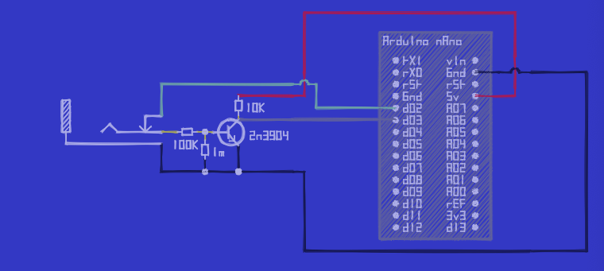
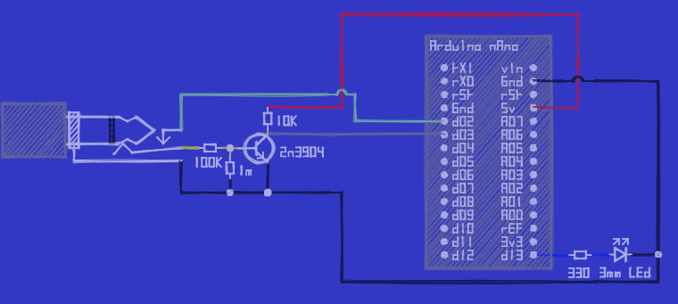

# modules-Clock2Arduino
Documentation and Code of an Eurorack Module, which realizes a Clock Input into an [Arduino Nano](https://store.arduino.cc/products/arduino-nano)

# About
I am working to build an Arduino Nano based Sequencer as Eurorack Module. 

For this I wanted to have an optional Clock Input, i.e. an jack, where one can plug  in a click signal, but does not have to. If nothing is plugged in, the Arduino shall use an internal clock instead. 
This repository here contains the schematics to build this and the code for the arduino to manage an internal clock, read an external clock and work with the corresponding signal. 

## Input Guard
An Arduino nano has some digital inputs, which expect to be either ~0V or at ~5V. Eurorack Modules create signals, which are often at ~5V, but they can be higher (or lower) in voltage, so 
it is quite risky to directly wire the input signal to the Arduino. Instead, some guarding or shielding is required to protect the arduino from being fried. 

Googling how to do this led me to this [reddit thread](https://www.reddit.com/r/synthdiy/comments/hpzyuz/what_do_i_need_to_make_an_arduino_input_pin/). From there I found the documentation of the [big honking button](https://blog.thea.codes/designing-big-honking-button/), some Eurorack Module, which has a shielded gate input. And from there I stumbled into the schematics of the [grids-module](https://pichenettes.github.io/mutable-instruments-documentation/modules/grids/downloads/grids_v02.pdf) of mutable instruments / Emilie Gillet. 

All three used an NPN-Transistor where the input-signal is connected to the base. The emitter is connected to the ground and the transistor's collector is directly connected to the arduino's input signal and via a resistor connected the 5v output of the arduino. This means, the arduino input is HIGH, when no input signal is present and as soon as the input signal receives a signal, the transistor opens up and pulls the input signal down to LOW. 
As transistor I followed the big honking button schematics and decided to go with an `2N3904`. The resistor sizes I copied from the grids design. Finally, I choose to use the `d02` port of the Arduino as input. 
This looks as follows: 

## Make external clock Signal optional
Next, I wanted the make the clock signal optional. So I programmed an internal clock signal, which the Arduino puts out to its `d03` port. So I used a 3.5mm jack with a switch instead of an unswitched one and directly connected the `d03` port to the switch. This can be seen as the light green connection in the next image:

Here, it does not change anything, because a plug is inserted, which disconnects the yellow input signal from the green internal clock signal. But if no plug is present as seen in the third image, both get connected and the Arduino feeds its internal clock signal via the guard to the `d02` port and reads it there again:

## Add an clock LED
Last but not least I did add a LED to the port `d13` of the Arduino, such that the Arduino can show its read clock state. This mainly is for debugging and being able to see, what is going on there. This is the final schematic:

# Licensing
The code here is available under the [MIT License](./LICENSE-Software), the hardware designs are available under [CC BY-SA 4.0](./LICENSE-Hardware).

# References

* Stargirl Flowers documentation of the big honking button with a gate guard: https://blog.thea.codes/designing-big-honking-button/
* Github repository of the big honking button: https://github.com/wntrblm/Big_Honking_Button
* Gate guard layout from Emilie Gillet for the grids module: https://pichenettes.github.io/mutable-instruments-documentation/modules/grids/downloads/grids_v02.pdf
* Arduino Nano: https://store.arduino.cc/products/arduino-nano

